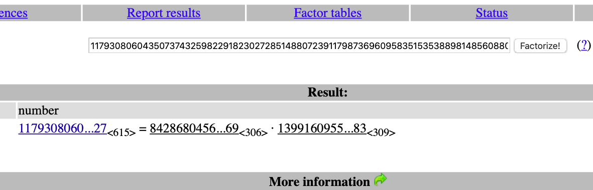

## 分析

拿到题目，就是一个简单的 RSA 题目，给出了 n 和密文 c


因为给出了 n 所以直接考虑能不能硬分解 n

把 n 放到[大整数在线分解网站](http://www.factordb.com/index.php)上试试看，确实可以分解，得到 p 和 q



既然都分解出 p 和 q 了，那么算出明文就没有难度了

顺便注意：大整数的高次幂可以用**模重复平方算法**来快速计算，自己实现也比较简单，但其实用 Python 自带的 pow 函数就够了

ps：**如果 RSA 没有给出公钥 e 的话，默认选择 e = 0x10001 即 65537**

ps：如果不知道什么是 RSA 加密算法或者对其原理不够了解，可以参见[阮一峰的网络日志](http://www.ruanyifeng.com/blog/2013/07/rsa_algorithm_part_two.html)

## exp

```python
#!/usr/bin/python3
from Crypto.PublicKey.RSA import inverse, long_to_bytes

c = 75186169332770398011618387278278132278790899252552138882799075432380607926731546030253687400295924217369315868839672386616943227315064045460865365296683033483186291570240079759200380250862319608787524113935879604728967164231477966741805601564635364322718438051545168770427777047667842857584346659655292503627681225184738425341914431617445650748762586933275572200060984083928949491872172407901109108320296584642767891651443970128071209300594102046815811229697489154488296004024544579726109722995921635677648742873800015194793794148142345457719541079982444120634269256199324030425798299206933898605904024426172410823
n = 117930806043507374325982291823027285148807239117987369609583515353889814856088099671454394340816761242974462268435911765045576377767711593100416932019831889059333166946263184861287975722954992219766493089630810876984781113645362450398009234556085330943125568377741065242183073882558834603430862598066786475299918395341014877416901185392905676043795425126968745185649565106322336954427505104906770493155723995382318346714944184577894150229037758434597242564815299174950147754426950251419204917376517360505024549691723683358170823416757973059354784142601436519500811159036795034676360028928301979780528294114933347127

p = 842868045681390934539739959201847552284980179958879667933078453950968566151662147267006293571765463137270594151138695778986165111380428806545593588078365331313084230014618714412959584843421586674162688321942889369912392031882620994944241987153078156389470370195514285850736541078623854327959382156753458569
q = 139916095583110895133596833227506693679306709873174024876891023355860781981175916446323044732913066880786918629089023499311703408489151181886568535621008644997971982182426706592551291084007983387911006261442519635405457077292515085160744169867410973960652081452455371451222265819051559818441257438021073941183

phi_n = (p-1)*(q-1) // 具体可参见 欧拉函数
e = 65537
d = inverse(e, phi_n) // 求 e 模 phi_n 的逆元

m = pow(c, d, n)
data = long_to_bytes(m) // 长整数转换为字节集

print(m)
print(data)

# 2222445378180646636797706006131586300103136428029746834289358120497533
# b'RoarCTF{wm-l1l11il1l1l11ll11}'

```

