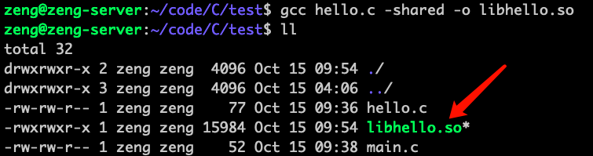
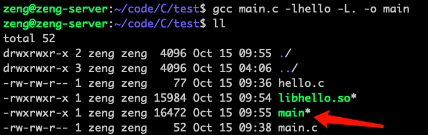
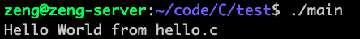
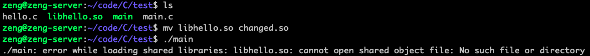
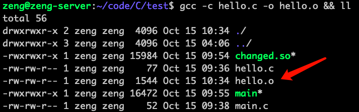
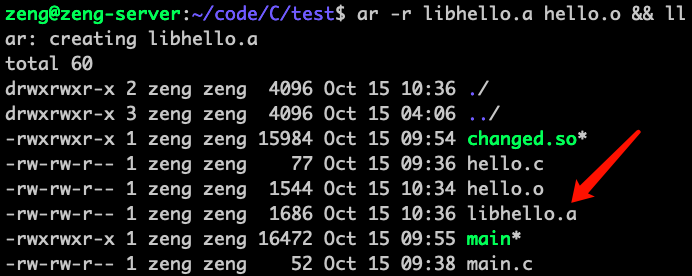
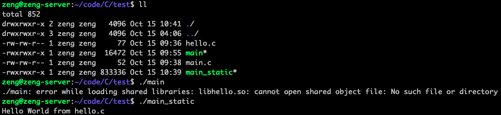

个人很看重编译和链接这层的东西，简单谈一谈C语言的动态链接和静态链接
### 动态链接
#### 简介
在做程序开发的时候，有许多简单的函数是很常用的，但是如果每个程序都把这些很常用的函数的实现包含在内的话，就会占用很多空间

有一个很好的办法，把这些常用的函数实现提取成单独的文件（动态链接库），放在某个地方，一个程序需要使用某个函数的时候再去加载对应的库，这样就能节省很多空间
#### 示例
```
// main.c
void hello();
int main()
{
    hello();
    return 0;
}
```
```
// hello.c
#include <stdio.h>

void hello()
{
    printf("Hello World from hello.c\n");
}
```
编译测试一下
`gcc main.c hello.c -o main && ./main`


接下来将`hello.c`编译成动态链接库试一试
`gcc hello.c -shared -o libhello.so`


可以看到编译出了`libhello.so`

接下来编译`main.c`，并且制定使用`libhello`这个库，在当前目录查找库文件
`gcc main.c -lhello -L. -o main`


运行一下试试



试试把`libhello.so`的名字改了，或者移动到其他地方，让`main`找不到动态库


可以很明确的看出，程序是在运行时动态加载`libhello.so`库的，如果这个库被移动或者改名了，程序就不能正常运行

用ldd命令看看动态库的依赖
`ldd ./main`


### 静态链接
#### 简介
静态链接就是直接把所有运行时需要的库，全部包含进程序中，打包在一起，这样就不管外面的库怎么移动怎么改名怎么缺少，程序都可以运行
#### 示例
还是之前的代码，将`hello.c`编译，但是不作链接
`gcc -c hello.c -o hello.o && ll`


再把`hello.o`打包成静态库文件
`ar -r libhello.a hello.o && ll`


再来编译`main.c`并且把`libhello.a`静态链接进程序中
`gcc main.c -lhello -L. -static -o main_static`


运行结果一切正常，并且跟静态库已经没有关系了，删掉静态库程序依然可以运行


用`ldd`命令看看
`ldd ./main_static`


### 小结
没有小结，自己看书去！