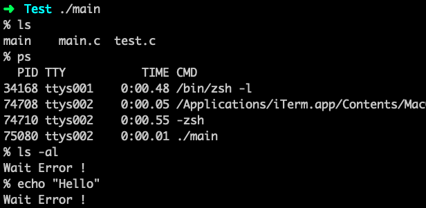
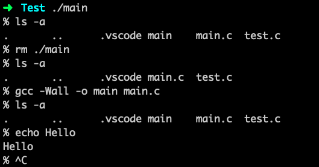

# C 语言实现简单 Shell

直接上代码

<!-- more -->

## 简单

```c
#include <stdio.h>
#include <string.h>
#include <unistd.h>
#include <sys/wait.h>

#define MAXLINE 1024

int
main(void)
{
    char  buf[MAXLINE];
    pid_t pid;
    int   status;

    printf("%% ");
    while(fgets(buf, MAXLINE, stdin) != NULL)
    {
        if(buf[strlen(buf) - 1] == '\n')
        {
            buf[strlen(buf) - 1] = 0;
        }

        if((pid = fork()) < 0)
        {
            printf("Fork Error !\n");
            return 1;
        }
        else if (pid == 0)
        {
            execlp(buf, buf, (char*)0);
        }

        if((pid = waitpid(pid, &status, 0)) < 0)
        {
            printf("Wait Error !\n");
            return 1;
        }
        printf("%% ");
    }
    return 0;
}

```

具体的原理很简单，循环从标准输入读取命令，读取到之后调用系统函数 execlp 执行命令。

## 演示

但是这样其实只能实现无参数调用，如果加参数就会产生错误，像这样



那么想办法来改进一下

## 改进

注意到 其实在调用 exec 系列函数是可以传数组参数的，其中有一个

```c
int	execvp(const char * __file, char * const * __argv);
```

于是，这样来改进程序

```c
#include <stdio.h>
#include <string.h>
#include <unistd.h>
#include <sys/wait.h>

#define MAXLINE 1024

int
main(void)
{
    char  buf[MAXLINE];
    pid_t pid;
    int   status;

    printf("%% ");
    while(fgets(buf, MAXLINE, stdin) != NULL)
    {
        int len = strlen(buf);
        char* argv[10] = {NULL};
        int args = 0;

        if(buf[len - 1] == '\n')
        {
            buf[len - 1] = 0;
        }
        
        // 将读取到的字符串，解析成参数的数组保存在 argv 中，再传给 execlp
        argv[args] = (char*)buf;
        for(int i = 0; i < len; i++)
        {
            if(buf[i] == ' ' && buf[i+1] != ' ')
            {
                buf[i] = 0;
                if(buf[i+1] != ' ')
                {
                    argv[++args] = (char*)(buf + i+1);
                }
            }
        }
      
        // fork 函数 一次调用两次返回，对父进程返回子进程的 pid ，对子进程返回 0，如果返回值小于 0 则表示有错误
        if((pid = fork()) < 0)
        {
            printf("Fork Error !\n");
            return 1;
        }
        else if (pid == 0)
        {
            execvp(argv[0], argv);
        }

        if((pid = waitpid(pid, &status, 0)) < 0)
        {
            printf("Wait Error !\n");
            return 1;
        }
        printf("%% ");
    }
    return 0;
}

```

## 再演示

看看改进后的效果，是否可以支持加参数了



就可以支持参数了，很好嗷
