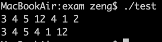
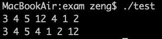

### 正文
今天写作业代码，遇到一些小问题，记录一下解决过程。

先贴出最早的问题代码
```
// linklist.c
#include <stdio.h>
#include <stdlib.h>

typedef struct node {
    int          data;
    struct node* next;
} node, *Node;

int main() {
    Node head = NULL, tail = NULL, p_new = NULL;
    int temp;
    while((scanf("%d", &temp) != EOF) && getchar() != '\n') {
        p_new = (Node)malloc(sizeof(node));
        p_new->data = temp;
        if(head == NULL)
        {
            head = p_new;
            tail = p_new;
        }
        tail->next = p_new;
        tail = p_new;
    }

    Node max = head, p = head;
    while(p != NULL) {
        if(p->data > max->data) {
            max = p;
        }
        p = p->next;
    }
    p = head;
    while(p != NULL && p->next != max) {
        p = p->next;
    }
    p->next = max->next;
    max->next = NULL;
    tail->next = max;
    p = head;
    while(p != NULL) {
        printf("%d ", p->data);
        p = p->next;
    }
    printf("\n");
    return 0;
}

```
从控制台输入一组数据（不定量），每输入一个就插入链表尾部，输入完成后找到最大节点并将最大节点移动到链表尾部

但是在测试的时候发现不对劲，出现了无限循环

经过一系列排查，发现是因为出现了**野指针**！

**在第15行，只给`p_new->data`赋值，没有给`p_new->next`赋值，`p_new->next`成为野指针，而在后面第26行等判断指针不为`NULL`的语句始终为真，导致无限循环**

**所以修改方案就是在第15行后面添加一行`p_new->next = NULL;`**

这一点修改之后，做测试，发现始终都不会打印出链表最后一个值



这就让我思考，难道是链表操作有误？

在经过一系列排查之后，再次找到问题所在

**第13行输入判断条件有误，`getchar() != '\n'` ，前面的字符后都是空格`' '`，但最后一个数后面的字符是`'\n'`，于是表达式为假，于是就没有后面的循环了，最后一个数也自然没加进链表**

**改进方法就是将循环改成下面这样**
```
while(scanf("%d", &temp)) {
    p_new = (Node)malloc(sizeof(node));
    p_new->data = temp;
    p_new->next = NULL;
    if(head == NULL)
    {
        head = p_new;
        tail = p_new;
    }
    tail->next = p_new;
    tail = p_new;
    if(getchar() == '\n') {
        break;
    }
}
```

这样就不会有问题啦


所以这次问题小记就到这里啦
