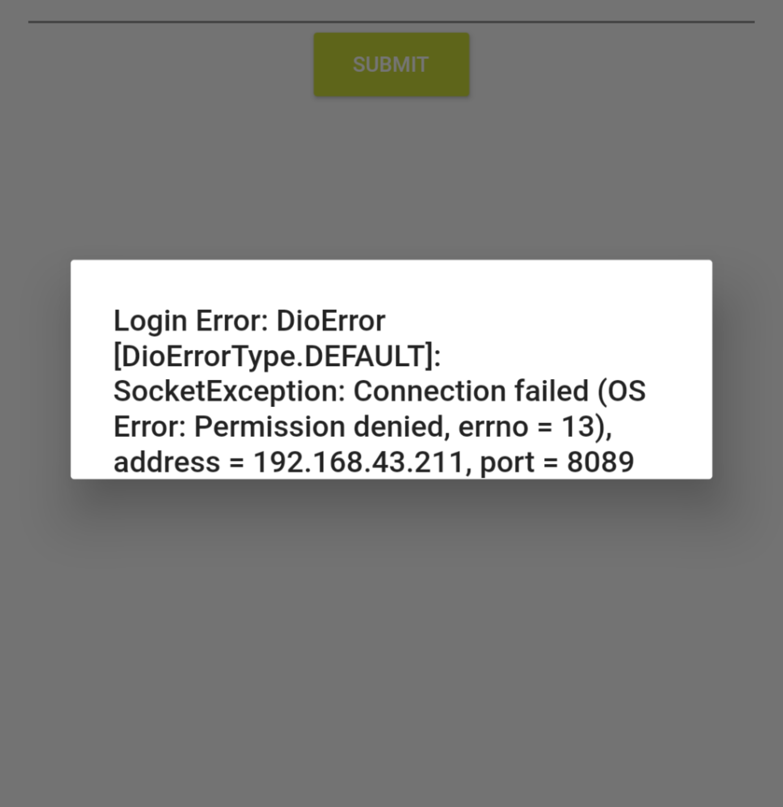

# Flutter Dio 网络问题一记

## 问题起因和描述

笔者无聊用 Flutter 写了个 APP 玩玩，在需要进行网络访问的时候，选择使用 [Dio](https://github.com/flutterchina/dio) 这个库

在 Debug 模式下表现一切正常，但是当我编译为发布版时，网络访问不能正常工作，错误为 Dio Error: OS Error: Permission Denied.



## 原因

读报错很容易知道，是权限问题，系统不允许进行网络访问

<!-- more -->

## 解决方案

既然是系统不给权限，那就让系统给权限就好了

在 {project}/android/app/src/main/AndroidMainfest.xml 文件，在application标签前面加一行

``` xml
<uses-permission android:name="android.permission.INTERNET"/>
```

允许使用网络权限

添加之后，重新编译，问题解决！
