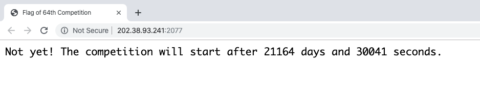
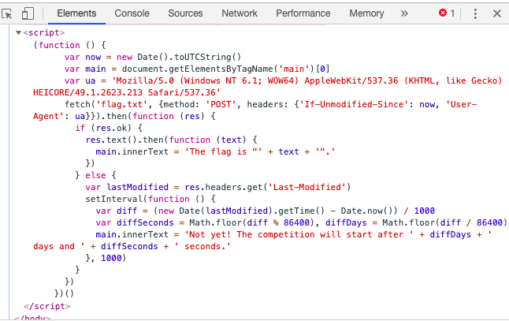
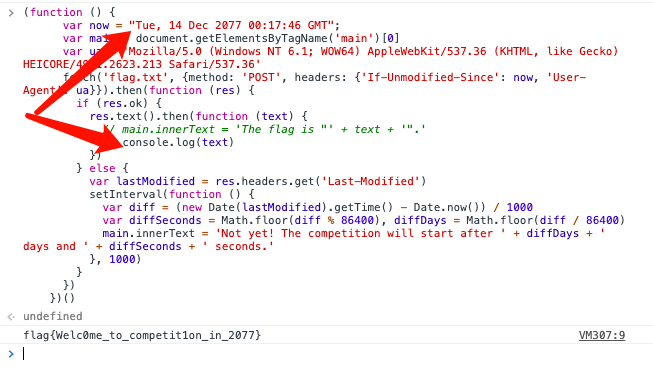
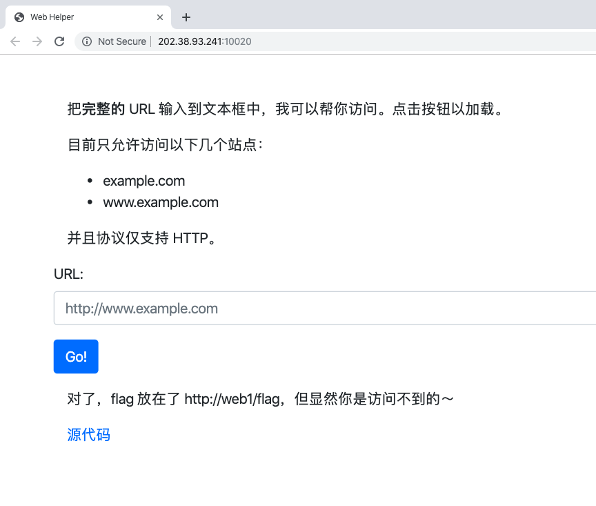
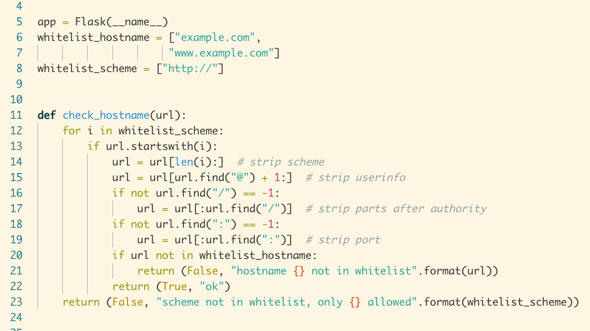
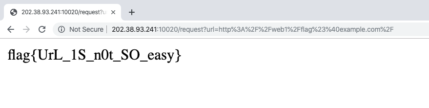
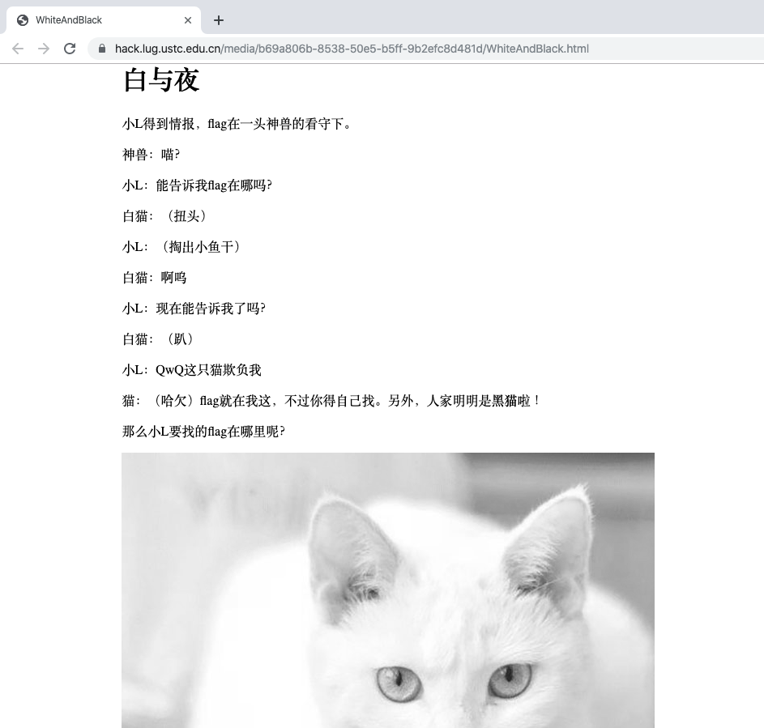
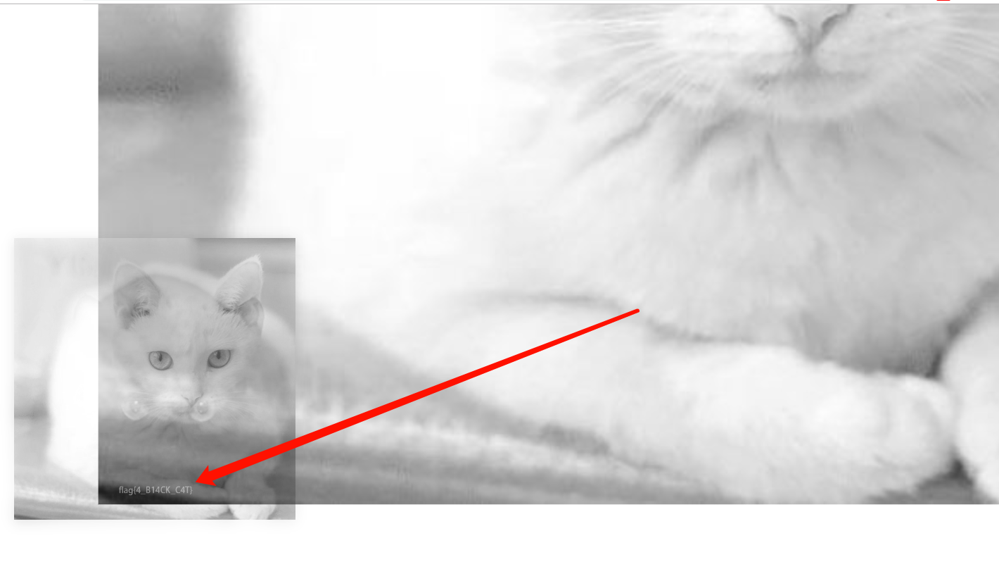
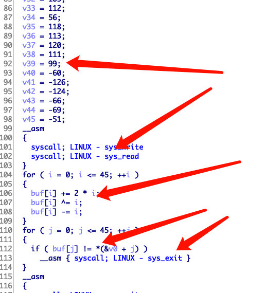

不得不说中科大的这个 [Hackergame](https://hack.lug.ustc.edu.cn/) 体验非常棒哦，不管是题目对新手的引导意义，以及。。总之各个方面都很棒啦，真后悔高中没努力读书。这次虽然没有做出很多题，但。。

ps: 没写 WriteUp 当然就是没做出来的题啦，可以在 Hackergame 官网找到官方 WriteUp 哦

## Web

### 签到题

签到很简单，把自己的 Token 输进去就拿到 flag 了

### 信息安全2077

这个也不难，打开网站后看到还剩两万多天，好可怕～



直接查看源代码，康康有什么猫腻，发现了一些东西哦



发现是取当前时间，然后发送到服务器，那简单了，直接把时间改到 2077 年

或者还可以把代码复制下来，放到 Chrome 的控制台里，把第二行 `var now = new Date()` 改成 2077 年的时间再重新调用函数去请求文件，并且直接把请求到的内容打到 console，像这样



于是就成功拿到 flag 啦

> flag{Welc0me_to_competit1on_in_2077}

### 网页读取器

看题目应该是 SSRF 的，题目页面还提供了源码下载



下载源码康康



发现对 url 的审查不是特别严格，于是尝试构造一个 url 来绕过

> http://web1/flag#@example.com/

没有检查 # 号，而且是取 @ 后面的内容检查，那直接用 # 把后面注释掉，成功拿到 flag



> flag{UrL_1S_n0t_SO_easy}


## General

### 白与夜

题目描述涉及到 黑 和 白 两个字，肯定有猫腻，打开题目一康，果然有！



图片是白猫，但是猫猫说自己是白猫，那么秘密肯定在图片上啦

把图片往深色的地方拖动一下，呀！



> flag{4_B14CK_C4T}

### 正则验证器

既然说卡住服务器 1 秒就有 flag 

用正则卡住还不简单吗，大家都知道正则如果出现回溯的话就会很慢，直接去 Google 一个正则的灾难性回溯例子，肯定卡住不只 1 秒的

> $ nc 202.38.93.241 10006
>
> Please input your token: here is your token
>
> Welcome to the free online Regular Expression Verifier
>
> Please enter your RegEx and string and I will match them for you
>
> 
>
> RegEx: (a+)*s
>
> String: aaaaaaaaaaaaaaaaaaaaaaab
>
> flag{R3g3x_can_D0S_c53670a401}

### 不同寻常的 Python 考试

这个题就是真的难了，考对 Python 语法的各种神奇的隐式转换的了解

先下载源码，可以看到有 20 个 challenge 答出 10 个就能拿 flag1 答出 15 个拿 flag2 全部答出拿 flag3，我只拿了个 flag1 // 毕竟不是专门学 Python 的

也就不写思路了，直接给 payload 吧，注意回答的输入是由 `ast.literal_eval` 函数解释的，而且只能是各个类型的字面量

#### challenge_1

> "Hello"

#### challenge_2

> (1, 1, [], [])

#### challenge_3

> "aaa"

#### challenge_4

> ([1], 2)

#### challenge_5

> [3, 2, 1]

#### challenge_6

> ({1}, {2})

#### challenge_7

> (2, [1], [2])

#### challenge_15

> ({1}, [{2}, {1}])

#### challenge_16

> (233, b"\xe9")

#### challenge_17

> (1, {0: 1})

###我想要个家

这个题考查对 Linux 基础知识的了解

用 chroot 改根目录， ln 链接文件保证写了随机数据之后读到一样的内容

用 date 命令改时间，然后 sleep 就直接用 C 写一个程序放进去就好了，不过注意编译的时候要静态链接，因为 chroot 改了根目录之后链接找不到库

## Math

### 宇宙终极问题

这个真的是终极问题噢，太难了，除了第一问大家都会

> 42 = (-80538738812075974)^3 + 80435758145817515^3 + 12602123297335631^3

注意这里 ^3 是 3 次方的意思，不是异或

数学太难啦！！！

## Binary

### 小巧玲珑的 ELF

没什么难度，读取数据之后进行简单的处理，和栈中的值比较



直接取出栈中的值逆向一下，得到 flag

```python
#!/usr/bin/python3

source = [ 102, 110, 101, 107,-125, 78, \
    109, 116, -123, 122, 111, 87, \
    -111, 115, -112, 79, -115, 127, \
    99, 54, 108, 110, -121, 105, \
    -93, 111, 88, 115, 102, 86, \
    -109, -97, 105, 112, 56, 118, \
    113, 120, 111, 99, -60, -126, -124, -66, -69, -51 ]

for i in range(0, 46):
    source[i] += i
    source[i] ^= i
    source[i] -= 2 * i
    if source[i] < 0:
        source[i] += 256

print(str(bytes(source), "utf8"))
# flag{Linux_Syst3m_C4ll_is_4_f4scin4ting_t00ls}

```

### Shell 骇客

这个有三个小题，第一个直接用普通的 getshell 的就行了，第二三有检查，要求 shellcode 在一定的范围内，就麻烦一点了，官方 WriteUp 说可以 Google 到一些工具帮助写出这样特殊的 shellcode ，只是我还没有去尝试，自己当时也没想过去 Google ，只做出来了第一题，等我过几天搞定二三再来一起补充这里

顺便，其实刚开始我还不会自己写 shellcode ，都是用别人现成的，后来遇到一个题，只允许使用 open read write 这几个 syscall ，逼得我不得不自己写 shellcode 于是找到了这个文章，发现其实自己动手写 shellcode 并不难

[教程在这里](https://paraschetal.in/writing-your-own-shellcode) 

### 献给最好的你

之前有个什么恶意软件吧，这个题应该是调侃一下之前那个，具体还是很简单，直接在手机上用 MT 管理器就做出来了

### 没有 BUG 的教务系统

这个也好难的，我只做出了第一问，第一问就是简单的逆向，第二问看源代码看了好久都没找到 bug 就放弃了，后来看官方 WriteUp 那叫一个气呀，居然放出源码是故意的！！