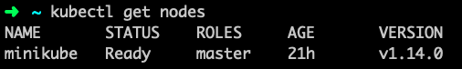
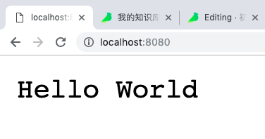
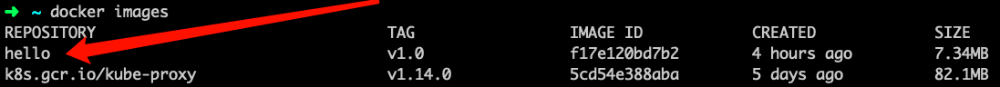
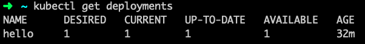
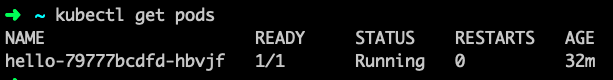
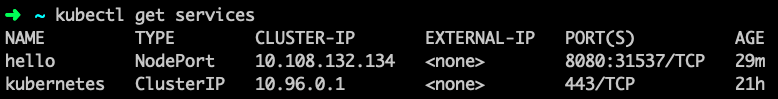
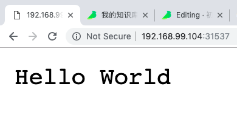

# 记录初探 Kubernetes 的过程

## 简介

一直有想学习 Kubernetes ，最近看了些书，也自己用了用，也遇到了一些小问题，值得写篇博客记录一下

## 安装

由于笔者仅是自学如何使用 Kubernetes，仅是单机版，还未到部署到生产环境的时候，且使用的是 Mac 电脑，故选择使用 Minikube

要安装使用 Minikube ，需要先安装 VirtualBox ，以下是一些过程

<!-- more -->

### VirtualBox

[VirtualBox官网](https://www.virtualbox.org) 提供了下载，或者可以到 [清华大学开源软件镜像站](https://mirrors.tuna.tsinghua.edu.cn/virtualbox/) 下载

下载完成之后，打开安装包安装即可

### Minikube

[Minikube](https://github.com/kubernetes/minikube) 是 Minikube 在 Github 中的项目地址，可以在 Release 标签中找到最新版本下载

> $ cd ~/Downloads
> $ chmod +x ./minikube
> $ mv ./minikube /usr/local/bin/minikube

这里是给下载的 minikube 加上执行权限后放到 /usr/local/bin 里面，也可以自己选择放在任意 PATH 里

然后运行测试一下是否安装完成
> $ minikube version
> minikube version: v1.0.0

正确显示出 minikube 的版本，安装成功！

### Kubectl

Kubectl 是用于控制 Kubernetes 的，可通过包管理程序安装(Mac 用 brew ，Centos 用 yum，Ubuntu 用 apt)
> $ brew install kubernetes-cli
> $ kubectl
> kubectl controls the Kubernetes cluster manager.
> 
> Find more information at: https://kubernetes.io/docs/reference/kubectl/overview/
> ...

安装成功，接下来可以准备启动了

## 启动

> $ minikube start
> 😄  minikube v1.0.0 on darwin (amd64)
> 🤹  Downloading Kubernetes v1.14.0 images in the background ...
> 💡  Tip: Use 'minikube start -p <name>' to create a new cluster, or 'minikube delete' to delete this one.
> 🏃  Re-using the currently running virtualbox VM for "minikube" ...
> ⌛  Waiting for SSH access ...
> 📶  "minikube" IP address is 192.168.99.104
> 🐳  Configuring Docker as the container runtime ...
> 🐳  Version of container runtime is 18.06.2-ce
> ⌛  Waiting for image downloads to complete ...
> ✨  Preparing Kubernetes environment ...
> 🚜  Pulling images required by Kubernetes v1.14.0 ...
> 🔄  Relaunching Kubernetes v1.14.0 using kubeadm ...
> ⌛  Waiting for pods: apiserver proxy etcd scheduler controller dns
> 📯  Updating kube-proxy configuration ...
> 🤔  Verifying component health .....
> 💗  kubectl is now configured to use "minikube"
> 🏄  Done! Thank you for using minikube!
>  
> $ kubectl get nodes



可以看到， minikube 启动成功之后，用 `kubectl get nodes` 可以成功获取到 nodes 的信息，一切正常！

## 写一个小服务，尝试部署

### Hello World 代码

此处采用Go语言，因为可以静态编译且语法简单

```go
// main.go
package main

import (
	"fmt"
	"net/http"
)

func main() {
	http.HandleFunc("/", handler)
	fmt.Println("Listening on http://localhost:8080/")
	http.ListenAndServe(":8080", nil)
}

func handler(w http.ResponseWriter, r *http.Request) {
	w.WriteHeader(http.StatusOK)
	w.Write([]byte("Hello World"))
}

```

> $ go run main.go
> Listening on http://localhost:8080/

用浏览器打开上面的网址可以看到



成功输出了 Hello World

下一步

### 静态编译

可能有人会问会什么要静态编译，不能直接 `go run main.go` 吗

如果用 `go run main.go` 来启动服务，那么还需要 Go 语言的开发环境，如果代码复杂一点还需要安装各种依赖库，会导致镜像过于庞大，因为这只是一个很小很简单的 Demo ，仅作测试的小玩具，静态编译出的可执行文件最大不到 10MB ，而为了不编译直接运行所需要的开发环境，至少都是 几百MB ，没有必要为了一个小 Demo 去浪费那么多资源，所以选择静态编译

> $ GOOS=linux CGO_ENABLED=0 go build -o main -ldflags '-extldflags "-static"' main.go

执行这条命令后可以看到当前目录下多了一个名为 main 的可执行文件

但是不能执行，因为当前是 MacOS 环境，而静态编译时指定的是 Linux 环境

ps: 如果读者是 Linux 环境当我没说

ps: 如果有读者看不懂这条命令，没关系不要怕，你不是不懂 Golang ，你只是不懂 C 而已

### 构建 Docker 镜像

要构建 Docker 镜像，我们先写一个 dockerfile

```dockerfile
FROM scratch
ADD ./main /main
CMD [ "/main" ]
```

ps: scratch 是一个空的 Docker 镜像，即不使用基础镜像的意思

写好 Dockerfile 后，在执行命令构建镜像之前，要确保minikube已经启动，并且执行一句神奇的命令先
> $ eval $(minikube docker-env)

在这条命令里藏着我半天的心酸，下一篇文章会仔细解释，这里先不作解释

再执行下面这些
> $ docker build -t hello:v1.0 .
> Sending build context to Docker daemon  11.73MB
> Step 1/3 : FROM scratch
> --->
> Step 2/3 : ADD ./main /main
> ---> 636350b5d281
> Step 3/3 : CMD [ "/main" ]
> ---> Running in a54d3c9c3864
> Removing intermediate container a54d3c9c3864
> ---> 321b69c05fff
> Successfully built 321b69c05fff
> Successfully tagged hello:v1.0
> $ docker images



可以看到，成功地构建了镜像，笔者这里镜像大小仅仅只有 7.34MB

### 部署

部署分为两个步骤

#### 创建 Deployments 和 Pods

> $ kubectl run hello --image=hello:v1.0 --port=8080
> deployment.apps "hello" created
> $ kubectl get deployments



> $ kubectl get pods



可以看到，Pods 已经准备好了

#### 创建 Service 以供外部访问

> $ kubectl expose deployment hello --port=8080 --type=NodePort
> service "hello" exposed
> $ kubectl get services



可以看到，service 已经创建成功，执行以下命令来查看 service 的 ip 和端口

ps: ip和端口以自己执行命令后输出的为准

> $ minikube service hello --url
> http://192.168.99.104:31537
> $ curl http://192.168.99.104:31537
> Hello World



使用浏览器打开，可以看到输出 Hello World，部署一切正常！

## 小结

在部署的过程中其实遇到了很多困难，我会在接下来的一篇文章中详细说明，如果有遇到相同困难的朋友可以参考参考
