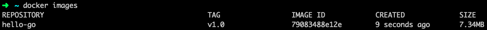
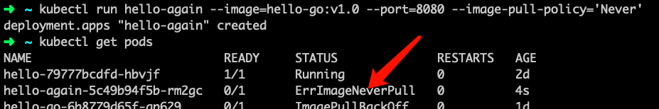
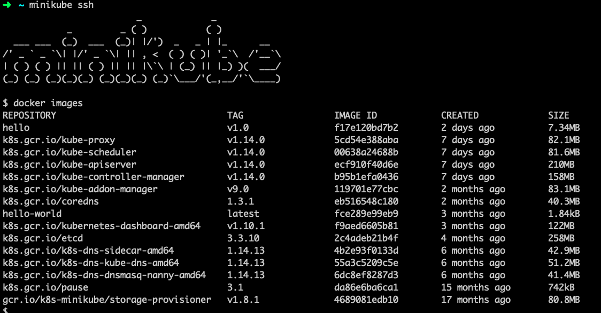
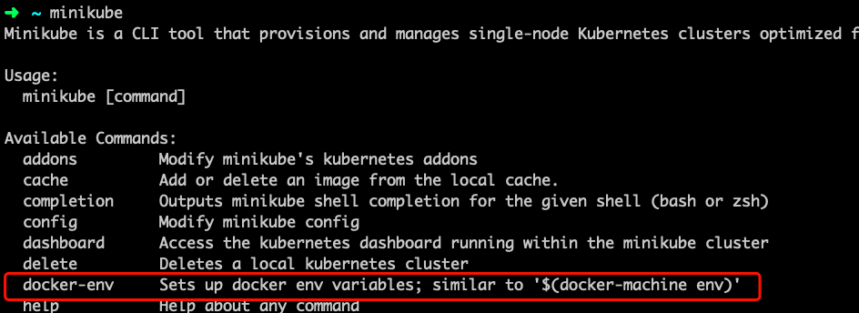
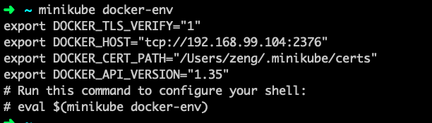
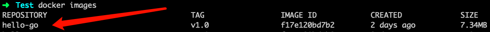

# 记录一些小问题

## VirtualBox 出现 NS_ERROR_FAILURE(0x80004005) 错误

这个问题我是很懵逼的，一开始不知道为什么出现的，经过许多查阅后，得到了几个解法（但是对我的问题没用，似乎这个错误的产生原因有许多）

1. 重装 VirtualBox
1. VirtualBox 文件夹里 改把 vbox 文件删了，重开虚拟机
1. 卸载重装后，在 设置-隐私和安全 中允许给 VirtualBox 权限

如果这几个方法解决不了你的问题，那还是自己Google吧

ps: 我的问题就很厉害了，同样是这个报错，但是百般搜索无果，可能是我动坏了底层的东西，重装系统之后问题解决

## Minukube 启动时 Pull Image 失败

这个问题。。主要还是因为 Kubernetes 是外国的嘛，国内访问的话延迟会比较高或者被 Block，所以解决方案也很简单

<!-- more -->

1. 代理
1. 用国内可以访问的源

### 代理

代理的话，就不用多解释了，一般配置好之后会监听在某个端口上，我们要做的就是让 Minikube 在 Pull Image 的时候走这个端口，直接在终端配置环境变量就行了

> export HTTP_PROXY=127.0.0.1:8080
> export HTTPS_PROXY=127.0.0.1:8080

或者

> HTTP_PROXY=127.0.0.1:8080 HTTPS_PROXY=127.0.0.1:8080 minikube start

### 能访问的源

这个就比较简单了，DockerHub，就行，虽然还是比较慢，很多 Kubernetes 的镜像在 DockerHub 都有嗷，只要Pull下来改一下 tag 就行了

> docker pull mirrorgooglecontainers/kube-apiserver:v1.14.0
> docker tag mirrorgooglecontainers/kube-apiserver:v1.14.0 k8s.gcr.io/kube-apiserver:1.14.0

## Kubernetes 使用 Docker 本地的 Image

上一篇文章中我提到了一个，没有解释的神奇命令，这里来解释一下

先说问题和解决方案，再详细描述

### 问题

问题就是 不知道本地有一个Docker，Minikube 里面还有另外一个 Docker，并不互通

### 解决方案

在执行 `docker build` 之前，先执行一句 `eval $(minikube docker-env)` 使 Docker client 连接到 Minikube 中的 Docker daemon 上，之后的操作就可以正常进行了

### 问题起源

自己写了一个简单的 HelloWorld 服务，打算用 Kubernetes 部署，看到书上讲 Kubernetes 是可以直接使用Docker 镜像的，于是将服务构建成镜像，但没有推送到 Hub 上，打算就在本地供测试使用，万万没想到，出现了一些问题

### 具体

构建镜像之后，执行 `docker images` 能看到镜像构建成功

但是在创建 Deployments 后启动 Pod 的时候出现了问题
> $ kubectl run hello-go --image=hello-go:v1.0 --port=8080
> deployment.apps "hello-go" created
> $ kubectl get pods

结果又出现了错误，实在搞不懂为什么明明本地有镜像 Minikube 却还要去拉取，禁用拉取之后又告诉不行，死活不使用本地的镜像，于是又开始查询，经过了很长时间的查询（可能书上有但我不仔细），才找到了解决方案和原因，**原来 Minikube 自己维护了一个 Docker daemon，可以通过 `minikube ssh` 命令连接到 Minikube 的 shell ，再执行 `docker images` 查看 Minikube 内的 Docker 镜像**

> $ minikube ssh
> $ docker images

可以看到，**原来 Minikube 的本地真的没有 hello-go 镜像，这就很好的解释了为什么它会去拉取镜像，设置为永不拉取之后出现错误的问题了**

知道问题因何而起，那解决起来就简单了

注意到 Minikube 有一个子命令 docker-env

执行看看

给出了 Minikube 内部 Docker daemon 的地址和端口，提示执行 `eval $(minikube docker-env)` ，照着做就可以使你的 Docker client 直接操作 Minikube 中的 Docker daemon，于是再构建镜像就是保存在 Minikube 中了

> $ eval $(minikube docker-env)
> $ cd ./projectDirectory     // 将工作目录切换到项目文件夹下
> $ docker build -t hello-go:v1.0 .
> $ docker images

这样，就成功构建了镜像并且镜像是保存在 Minikube 中的 Docker 中了，再用 kubectl 创建 deployments

> $ kubectl run hello-nice --image=hello-go:v1.0 --port=8080
> deployment.apps "hello-nice" created
> $ kubectl get pods

可以看到，不仅新建的 Pods 正常运行了，而且之前因为没有镜像而出错的 Pods 都正常了！

## 小结

在尝试minikube的过程中笔者就只遇到了这些问题，很庆幸都解决掉了，那这篇文章就记录到这里。

读者在Minikube使用过程中有什么问题都可以联系笔者噢，说不定可以帮点小忙:)
