既然我已经搭建了个人博客，就想要把方法也分享给我的朋友们，让朋友们也能搭建一个自己的博客~~(提升逼格)~~。不多说，下面就是教程。
#### 基础需求
联网的电脑一台，以下教程仅以Windows操作系统做示范
GitHub账号一个，如果没有账号可前往[GitHub官网](https://github.com)免费注册
域名一个（也可以不用）， 可前往[阿里云](https://cn.aliyun.com)进行域名注册
#### 环境搭建
##### NodeJs 的安装
打开[NodeJs官网](https://nodejs.org)后点击DOWNLOADS后可见到如下界面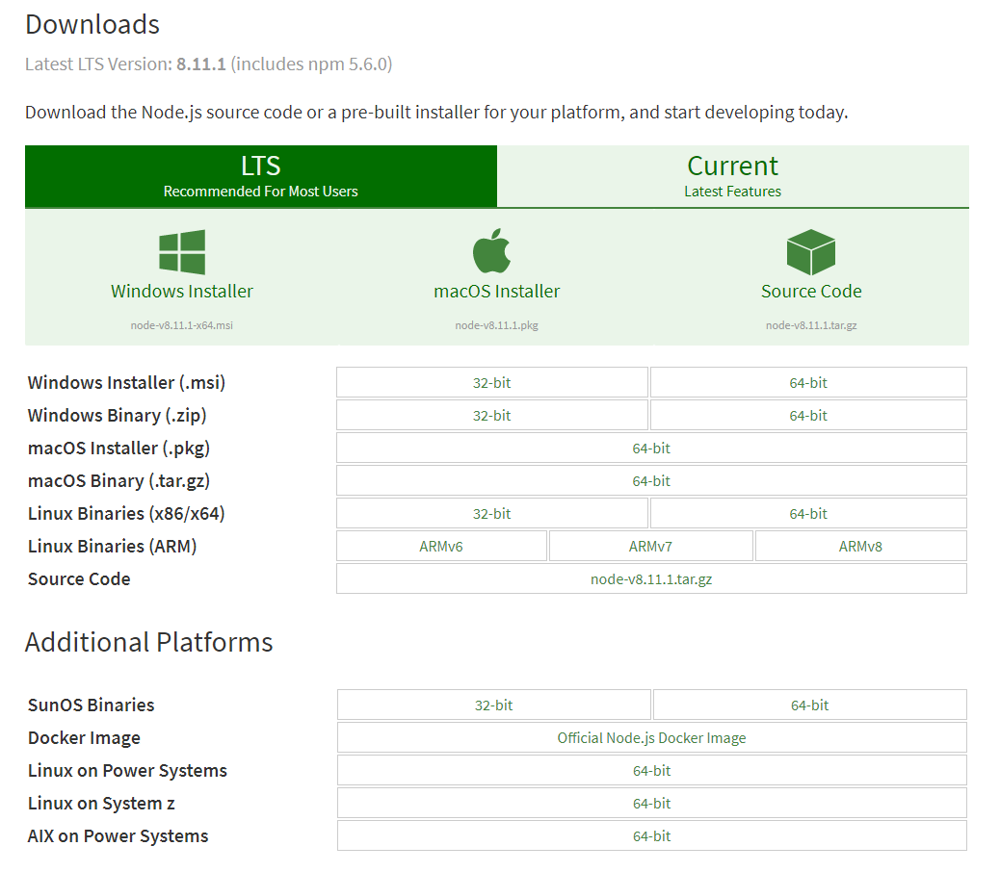
下载自己对应平台的NodeJs，进行安装，安装完成后打开命令提示符或者终端，输入
 >node -v

如果输出NodeJs的版本号，参见下图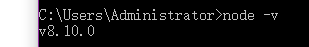
说明安装NodeJs成功。
##### Hexo的安装及博客搭建
打开命令行,确保电脑接入网络，输入
>npm install -g hexo-cli

等待一两分钟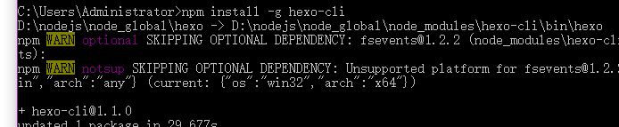
如图安装完成后，再输入
>cd desktop

把命令提示符的工作目录设置到桌面上，再输入
>hexo init myblog

出现如图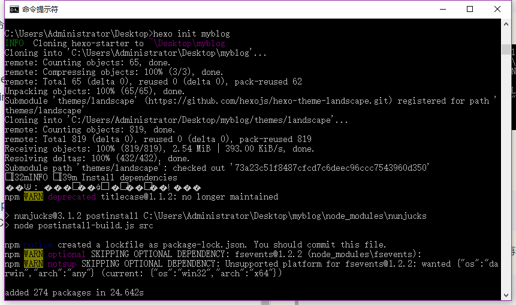
说明初始化成功，可以见到桌面上多了一个名为myblog的文件夹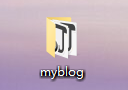
再在命令行输入
>cd myblog
>hexo generate
>hexo server

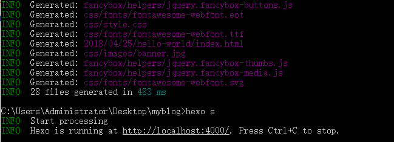如果如图所示，说明博客初步搭建成功了，可以打开浏览器输入网址http://localhost:4000/ 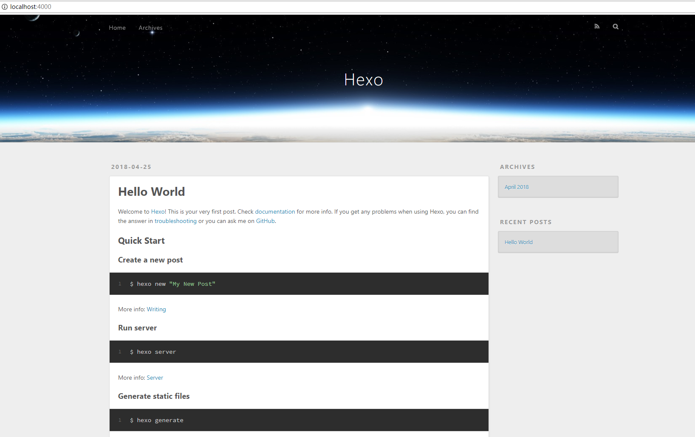可见到如图的页面，不过这还只是本地的，接下来就来让它可以被外网访问。
##### GitHub仓库创建
首先，你需要一个GitHub的账号，如果没有账号可以自己注册，此处省略注册教程，打开[GitHub官网](https://github.com)，登陆账号，进入页面后点击创建仓库用以存放博客，输入仓库名称为
>**你的GitHub用户名**.github.io

例如我的用户名是Zeng1999,就输入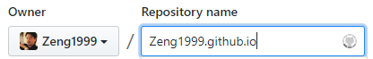然后点击下面的创建仓库。创建完成后就开始Git的安装。

##### Git的安装及配置
Git是一个开源的分布式版本控制系统，我们可以使用Git将网站同步到GitHub上。
可到[Git官网](https://git-scm.com/)进行下载和安装，这里不再赘述。
安装完成后，在桌面单击右键点击Git Bash Here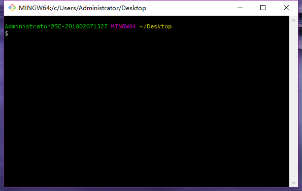输入
>git config --global user.name **你的GitHub用户名**
>git config --global user.email **你的GitHub注册邮箱**

生成密钥文件：
>ssh-keygen -t rsa -C **你的GitHub注册邮箱**

提示输入保存目录，回车使用默认目录即可
提示输入密码短语，输完后回车
提示再次输入密码短语，输入相同的密码后回车
密钥生成完成，可在用户目录下的.ssh文件夹下找到 id_rsa.pub 公钥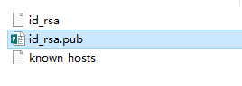右键以文本形式打开，复制其中的全部内容后关闭
打开GitHub，点击自己头像-settings再在左边找到SSH and GPG keys这一项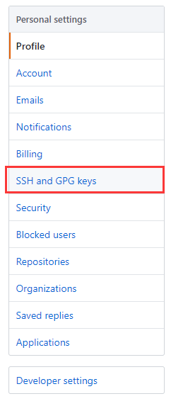找到New SSH key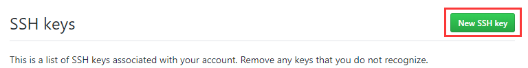点击，标题可任意，把刚才复制的粘贴到key栏中再点击 Add SSH key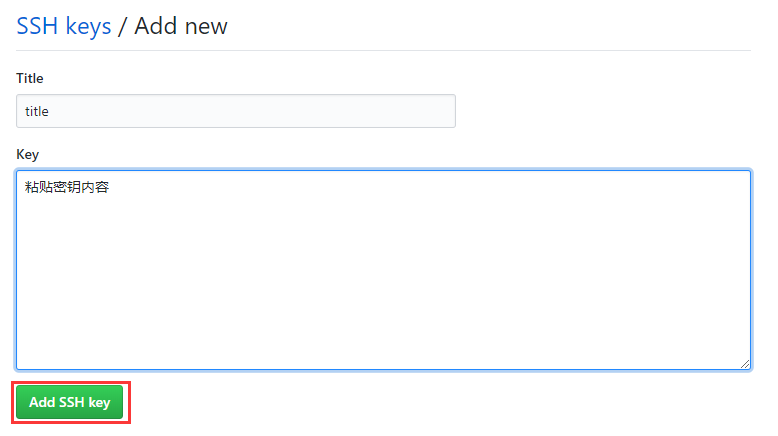
添加完成后再打开Git Bash，输入
>ssh git@github.com

如果出现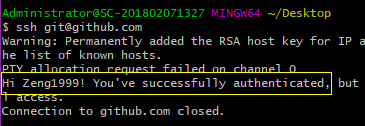则表明密钥可用，能连接上GitHub了。
##### 外网部署
找到之前在桌面上生成的文件夹myblog打开，找到一个名为_config.yml的文件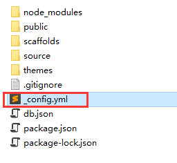用文本编辑器打开，找到最后的几行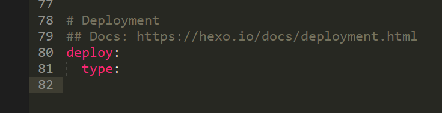改成如图，图中**红框部分修改为你的GitHub用户名**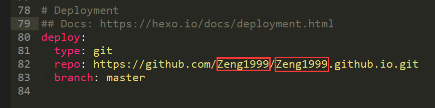修改完后保存并关闭文本编辑器。
打开桌面上的myblog文件夹，按住shift单击右键，点击在此处打开power shell窗口 或者 在此处打开命令提示符，再打开的窗口输入
>npm install hexo-deployer-git --save
>hexo clean
>hexo generate
>hexo deploy

出现如图提示，部署到GitHub成功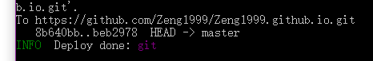
激动人心的时刻到了，打开浏览器打开网址 **你的GitHub用户名.github.io** 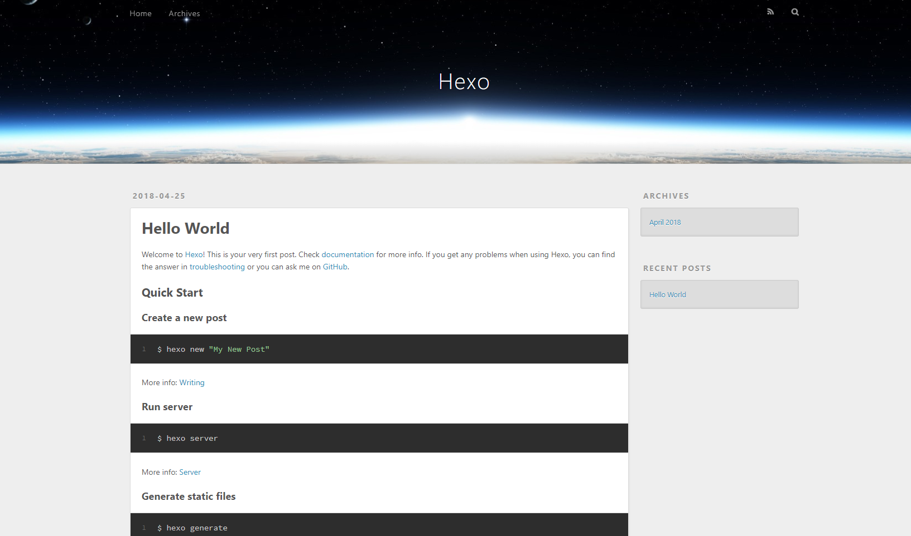
出现博客主页，部署完成，可从外网访问你的博客了
##### 使用个性域名
首先，你需要有一个域名，可以到[阿里云](https://cn.aliyun.com)进行域名注册，具体操作就不演示了，我已经有了一个域名，下面演示如何通过个性域名访问到个人博客。
打开GitHub，打开博客的仓库，点击设置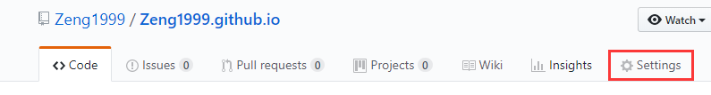找到下面这一行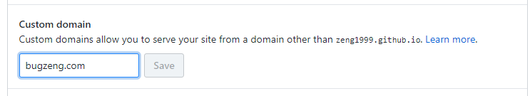输入你的域名后点击Save保存。

设置域名解析，以阿里云为例，进入控制台，找到云解析DNS，点击要用作博客的域名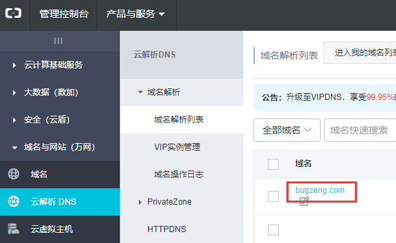然后点击 添加解析 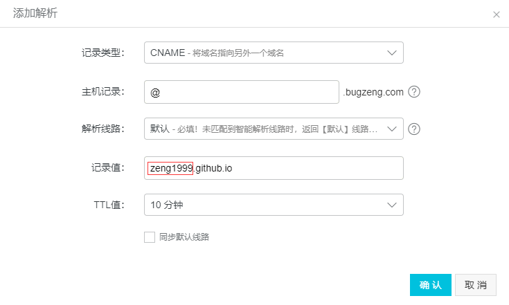把红框内的修改为你的GitHub用户名，点击确认。

打开MyBlog文件夹，打开其中的source文件夹，新建一个文本文档，重命名为**CNAME（无后缀名）**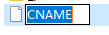然后用文本编辑器打开，输入你的域名，保存关闭即可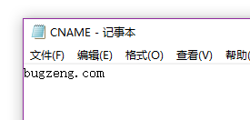至此，域名设置就完成了。在MyBlog文件夹下打开命令行，输入
>hexo generate
>hexo deploy

打开浏览器，访问你的个人博客吧！
