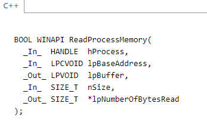
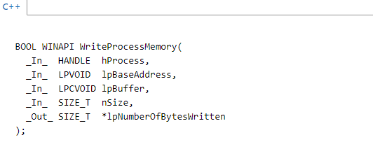
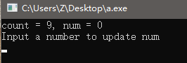
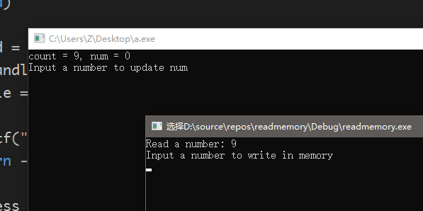
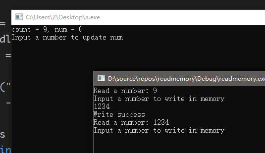
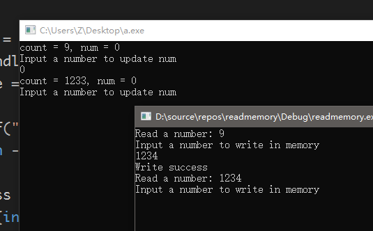
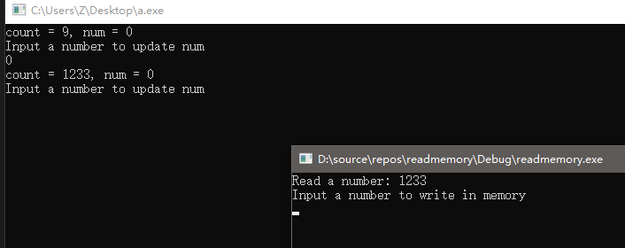

为什么会有这样一篇博客呢，读写进程内存，~~谁没事了干这种事情啊~~。这个呢，还得从我最早接触编程说起。

以前，我还是个网瘾青年，喜欢玩地下城与勇士这款网络游戏，无奈自己又没有人民币，装备又不好，玩起来特别没劲。偶然一次接触到了一个开外挂的人，带我，然后介绍给我一些免费外挂。于是我就接触到了外挂这种东西，发现地下城与勇士这款游戏的许多外挂都是由一个叫做易语言的编程语言写出来的，于是，我接触到了易语言，刚接触什么都不会，只会抄袭别人的外挂源码(抄袭可耻)。把进程名换成其他进程的名字，就能够修改其他进程的数据，然后地址栏，修改成不同的地址，就能修改不同地址的数据，当时觉得特别神奇，好奇心害死猫，于是我开始学习编程，最开始还是在学习易语言，因为它是全中文编程。而且可以很简单的做出一个窗口，按钮等等，而不是刚接触C语言时的一堆黑框，创建窗口还要先注册窗口类，实例化窗口，显示窗口什么的。。。

用易语言写一个外挂可太简单了，可当我正规的读到了大学，进入了计算机系，正规的学习了其他编程语言后。才知道其实易语言是封装的C++语言，易语言能够实现的，C++都可以实现，~~确切的来说，C++是万能的~~。

记得当时最有印象的几个函数名字是，十六到十，写内存整数型，写内存字节集等等，其实就是简单的把内存地址十六进制转成十进制，修改内存数据什么的，或者还有键盘监视和hook之类的就不谈了，这又是一个大话题。

读写进程内存在易语言中很好实现，几个文字，写参数就行了，其实在C++中也并不复杂，只要有相应的API就行了，于是在MSDN查询到了两个API，[ReadProcessMemory](https://msdn.microsoft.com/en-us/library/windows/desktop/ms680553(v=vs.85).aspx) 和 [WriteProcessMemory](https://msdn.microsoft.com/en-us/library/windows/desktop/ms681674(v=vs.85).aspx) ，可以点击进入MSDN看详细的解释。这里只作简单介绍


可以看到，这两个函数很相似，都接受五个参数，
1. 读取（写入）数据的进程句柄
2. 要读取（写入）的地址
3. 读取到（用作写入）的数据的存放指针
4. 希望读取（写入）的大小
5. 实际读取（写入）的大小的存放指针

返回值：执行成功时，返回非0值，出错了返回0

进程句柄需要通过`OpenProcess`函数或者`CreateProcess`函数返回，这里时读取（写入）其他进程而非子进程，使用`OpenProcess`，我先写一个小程序来做**被修改**程序。
```
#include <stdio.h>

int main(void)
{
	int count = 10, num = 0;
	while(count--)
	{
		printf("count = %d, num = %d\nInput a number to update num\n", count, num);
		scanf("%d", &num);
	}
	printf("count < 0, Process end, press enter to close console\n");
	getchar();
	getchar();
	return 0;
}
```
编译运行后
很清楚的显示了每个变量的值，方便我们去检验后面读取到的值是否正确或者是否成功修改，先放到一边。

开始写读取和写入进程内存的程序。
```
#include <Windows.h> // 上面提到的API都是在这里声明的
#include <cstdio> // C标准IO库
#include <cstdlib> // C标准库

int main(void)
{
	DWORD pid = (DWORD)8512; // 进程PID，可通过任务管理器查看，自行修改成被修改程序的PID
	HANDLE handle = OpenProcess(PROCESS_ALL_ACCESS, FALSE, pid); // 获得进程句柄
	if (handle == INVALID_HANDLE_VALUE) // 出错就报错和退出
	{
		printf("OpenProcess failed\n");
		return -1;
	}
	int address = 0x0061FE4C; // 要读取和修改的内存地址，可以通过CheatEngine获取，这里是变量count的地址
	int *p = (int*)malloc(sizeof(int)); // 动态申请内存(似乎不动态申请会报错，不懂为啥)
	DWORD len = 0;
	while (true)
	{
		if (ReadProcessMemory(handle, (LPCVOID)address, p, sizeof(int), &len)) // 读取
		{
			printf("Read a number: %d\n", *p); // 打印出读取到的值
		}
		printf("Input a number to write in memory\n"); 
		scanf_s("%d", p); // 输入用作写入的值
		if (WriteProcessMemory(handle, (LPVOID)address, p, sizeof(int), &len)) // 写入
		{
			printf("Write success\n");
		}
	}
	system("pause");
	return 0;
}
// 以上代码在 Windows10专业版 VisualStudio 2017 专业版编译通过
```
编译运行

可以看到，成功的读取到了变量count的值，再试试修改count的值，输入1234，回车

修改成功了！从另一个程序看看


果然修改成功了！！！多么激动人心，count 自减了一次，再读取一下试试


<br>至此，很简单的内存读写就实现了，多使用这几个API，就可以熟练的去修改一些内存中的值啦，可以用C++做一些小游戏的外挂了哦。