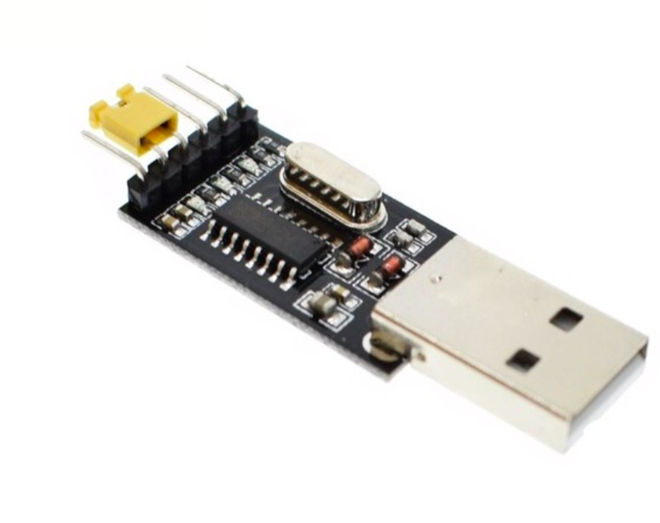

## 前言

作为一个计算机的学生，似乎倒腾单片机不太算正路，不过是应老同学的要求，那硬着头皮也要上呀，即使没有任何经验。

朋友让我帮忙做一个 超声波测距警报的小型电子设备，而且要在警报的时候通知周围的其他相同设备，一起报警

于是对单片机没有任何经验的我，开始了一条神奇的摸索之路

Ps：其实自己有稍微捣腾过树莓派，但是树莓派和单片机的差距还是有点大的，所以也可以算作是没有经验吧

## 资料收集

因为有捣腾树莓派的微弱经验，知道要做出这些功能肯定需要很多传感器，于是去买了有

- 超声波测距模块
- 蓝牙模块
- 有源蜂鸣器
- STM32F103C8T6 最小开发版
- USB to TTL 模块

不知道为什么选择了 STM32 而不是大家都会的 51 单片机，可能是因为不想太容易完成吧（以至于后面有问题问同学的时候大家都只会 51 于是我自己的问题还得自己解决），不过现在来看的话，STM32 还是非常不错的，而且很便宜

下载了很多资料，各个模块的开发手册，单片机的开发手册，CSDN 上找到了各种教程，于是准备开始动工

## 初步动手

刚开始我还不知道 Keil 这个软件的，也不知道什么叫所谓的 “下载”，“串口” 之类的，也还没有买 STM32 单片机，因为我以为有自己的树莓派就够了，于是拿着一堆传感器往面包版上一接就开始敲代码，因为树莓派有成熟的 GPIO 库和图形化的操作系统，于是一下子就写出了基本的代码，实现了基本的测距和报警功能。

这样虽然简单，但是我要怎么才能做出两个设备来呢，还要让其互相通信，这似乎是个问题。于是我选择了 STM32 单片机。

单片机到手之后，我纯粹是懵逼状态，哦，就两个板子，两根线，怎么用啊？下载的什么所谓最小系统原理图，什么各种电路图看得头大，并且毫无头绪。

又是各种查查查，知道可以通过 J-Link 方式烧录程序，但是这个 J-Link 似乎又要什么硬件设备来连接，看得我又是头大，到最后终于发现似乎可以通过 USB 来烧录，不过也需要购买一个连接设备，就是那个 USB to TTL 的东西。（到后来才知道这东西，不仅可以烧录程序，还可以调试蓝牙模块，真的是非常酷）

又从同学口中了解到可以用 Keil 这个软件来写程序，于是正途开始了

## 正式路途

下载好 Keil 之后随意编译了一个 每 0.5 秒开关一次小灯的 example （编译的时候需要选择设备诶），然后烧录进单片机，哇，果然真的可以诶，不过刚开始烧录真的觉得好麻烦诶

1. 

